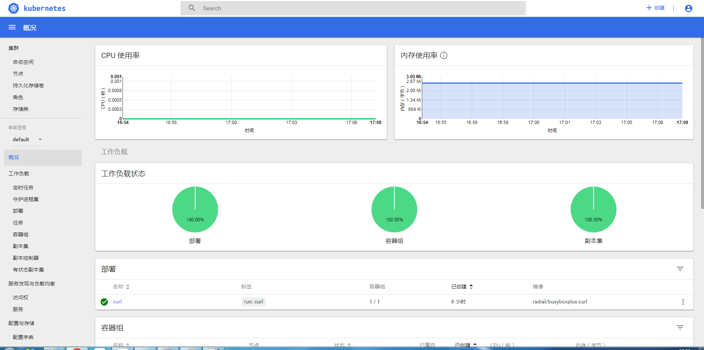
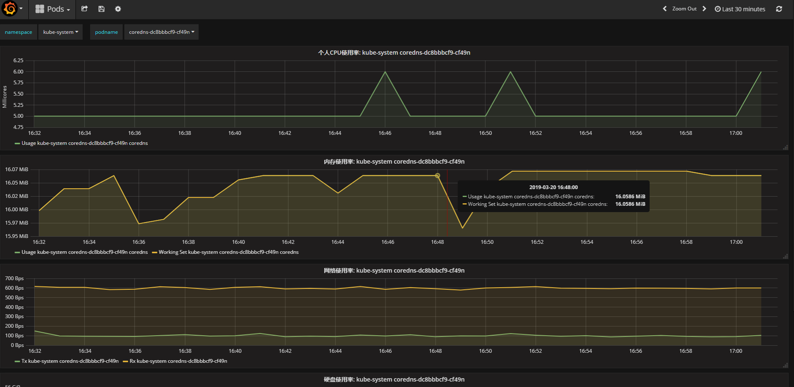

# heapster + grafana + influshDB 监控部署

## 1.下载v1.5.4.tar.gz 包

``` bash
cd /opt/soft/heapster-1.5.4/deploy/kube-config/influxdb

```

## 2.修改yaml 文件

heapster.yaml

``` bash
apiVersion: v1
kind: ServiceAccount
metadata:
  name: heapster
  namespace: kube-system
---
apiVersion: extensions/v1beta1
kind: Deployment
metadata:
  name: heapster
  namespace: kube-system
spec:
  replicas: 1
  template:
    metadata:
      labels:
        task: monitoring
        k8s-app: heapster
    spec:
      serviceAccountName: heapster
      containers:
      - name: heapster
        image: registry.cn-hangzhou.aliyuncs.com/peter1009/heapster-amd64:v1.5.3   #（1）修改镜像地址
        imagePullPolicy: IfNotPresent
        command:
        - /heapster
        - --source=kubernetes:https://192.168.1.150:6443?kubeletHttps=true&kubeletPort=10250&insecure=true #（2）修改api地址
        - --sink=influxdb:http://192.168.1.160:31001 #（3）修改数据源地址，采集的数据存放到influxdb
---
apiVersion: v1
kind: Service
metadata:
  labels:
    task: monitoring
    # For use as a Cluster add-on (https://github.com/kubernetes/kubernetes/tree/master/cluster/addons)
    # If you are NOT using this as an addon, you should comment out this line.
    kubernetes.io/cluster-service: 'true'
    kubernetes.io/name: Heapster
  name: heapster
  namespace: kube-system
spec:
  ports:
  - port: 80
    targetPort: 8082
  selector:
    k8s-app: heapster
    
```

grafana.yaml

``` bash
apiVersion: extensions/v1beta1
kind: Deployment
metadata:
  name: monitoring-grafana
  namespace: kube-system
spec:
  replicas: 1
  template:
    metadata:
      labels:
        task: monitoring
        k8s-app: grafana
    spec:
      containers:
      - name: grafana
        image: registry.cn-hangzhou.aliyuncs.com/inspur_research/heapster-grafana-amd64:v4.4.3 # (1) 修改镜像地址
        ports:
        - containerPort: 3000
          protocol: TCP
        volumeMounts:
        - mountPath: /etc/ssl/certs
          name: ca-certificates
          readOnly: true
        - mountPath: /var
          name: grafana-storage
        env:
        - name: INFLUXDB_HOST
          value: monitoring-influxdb
        - name: GF_SERVER_HTTP_PORT
          value: "3000"
          # The following env variables are required to make Grafana accessible via
          # the kubernetes api-server proxy. On production clusters, we recommend
          # removing these env variables, setup auth for grafana, and expose the grafana
          # service using a LoadBalancer or a public IP.
        - name: GF_AUTH_BASIC_ENABLED
          value: "false"
        - name: GF_AUTH_ANONYMOUS_ENABLED
          value: "true"
        - name: GF_AUTH_ANONYMOUS_ORG_ROLE
          value: Admin
        - name: GF_SERVER_ROOT_URL
          # If you're only using the API Server proxy, set this value instead:
          # value: /api/v1/namespaces/kube-system/services/monitoring-grafana/proxy
          value: /
      volumes:
      - name: ca-certificates
        hostPath:
          path: /etc/ssl/certs
      - name: grafana-storage
        emptyDir: {}
---
apiVersion: v1
kind: Service
metadata:
  labels:
    # For use as a Cluster add-on (https://github.com/kubernetes/kubernetes/tree/master/cluster/addons)
    # If you are NOT using this as an addon, you should comment out this line.
    kubernetes.io/cluster-service: 'true'
    kubernetes.io/name: monitoring-grafana
  name: monitoring-grafana
  namespace: kube-system
spec:
  # In a production setup, we recommend accessing Grafana through an external Loadbalancer
  # or through a public IP.
  # type: LoadBalancer
  # You could also use NodePort to expose the service at a randomly-generated port
  type: NodePort # (2) 修改为nodePort方式
  ports:
  - nodePort: 30108  # (3) 增加NodePort 端口
    port: 80
    targetPort: 3000
  selector:
    k8s-app: grafana
```
influxdb.yaml

``` bash
apiVersion: extensions/v1beta1
kind: Deployment
metadata:
  name: monitoring-influxdb
  namespace: kube-system
spec:
  replicas: 1
  template:
    metadata:
      labels:
        task: monitoring
        k8s-app: influxdb
    spec:
      containers:
      - name: influxdb
        image: registry.cn-hangzhou.aliyuncs.com/inspur_research/heapster-influxdb-amd64:v1.3.3 # (1) 修改镜像进行地址
        volumeMounts:
        - mountPath: /data
          name: influxdb-storage
      volumes:
      - name: influxdb-storage
        emptyDir: {}
---
apiVersion: v1
kind: Service
metadata:
  labels:
    task: monitoring
    # For use as a Cluster add-on (https://github.com/kubernetes/kubernetes/tree/master/cluster/addons)
    # If you are NOT using this as an addon, you should comment out this line.
    kubernetes.io/cluster-service: 'true'
    kubernetes.io/name: monitoring-influxdb
  name: monitoring-influxdb
  namespace: kube-system
spec:
  type: NodePort # (2) 修改NodePort方式
  ports:
  - nodePort: 31001 # (3) 增加nodePort
    port: 8086
    targetPort: 8086
  selector:
    k8s-app: influxdb
```
修改权限脚本

``` bash
  cd /opt/soft/heapster-1.5.4/deploy/kube-config/rbac
  
  kind: ClusterRoleBinding
  apiVersion: rbac.authorization.k8s.io/v1beta1
  metadata:
    name: heapster
  roleRef:
    apiGroup: rbac.authorization.k8s.io
    kind: ClusterRole
    name: system:kubelet-api-admin  # 修改集群角色
  subjects:
  - kind: ServiceAccount
    name: heapster
    namespace: kube-system

```


## 3.安装

``` bash

  cd /opt/soft/heapster-1.5.4/deploy
  sh kube.sh start --安装
  sh kube.sh stop --卸载
  
  cd /opt/soft/heapster-1.5.4/deploy/kube-config/rbac
  kubectl apply -f .
``` 

## 4.检查

``` bash 
    NAME                                        READY   STATUS    RESTARTS   AGE     IP            NODE            NOMINATED NODE   READINESS GATES
  pod/coredns-dc8bbbcf9-cf49n                 1/1     Running   1          8d      10.254.28.2   192.168.1.170   <none>           <none>
  pod/heapster-55d759dd6f-w88k4               1/1     Running   0          6h15m   10.254.98.6   192.168.1.160   <none>           <none>
  pod/kubernetes-dashboard-84cbc48df7-glzdk   1/1     Running   0          2d      10.254.98.5   192.168.1.160   <none>           <none>
  pod/monitoring-grafana-67f6988fb-2zmdm      1/1     Running   0          6h15m   10.254.28.7   192.168.1.170   <none>           <none>
  pod/monitoring-influxdb-67fd64ffdd-vgxqq    1/1     Running   0          6h15m   10.254.98.7   192.168.1.160   <none>           <none>

  NAME                           TYPE        CLUSTER-IP       EXTERNAL-IP   PORT(S)          AGE     SELECTOR
  service/heapster               ClusterIP   10.254.99.98     <none>        80/TCP           6h15m   k8s-app=heapster
  service/kube-dns               ClusterIP   10.254.0.10      <none>        53/UDP,53/TCP    8d      k8s-app=kube-dns
  service/kubernetes-dashboard   NodePort    10.254.21.9      <none>        443:33929/TCP    2d      k8s-app=kubernetes-dashboard
  service/monitoring-grafana     NodePort    10.254.194.152   <none>        80:30108/TCP     6h15m   k8s-app=grafana
  service/monitoring-influxdb    NodePort    10.254.121.36    <none>        8086:31001/TCP   6h15m   k8s-app=influxdb

  NAME                                   READY   UP-TO-DATE   AVAILABLE   AGE     CONTAINERS             IMAGES                                                                             SELECTOR
  deployment.apps/coredns                1/1     1            1           8d      coredns                coredns/coredns:1.2.6                                                              k8s-app=kube-dns
  deployment.apps/heapster               1/1     1            1           6h15m   heapster               registry.cn-hangzhou.aliyuncs.com/peter1009/heapster-amd64:v1.5.3                  k8s-app=heapster,task=monitoring
  deployment.apps/kubernetes-dashboard   1/1     1            1           2d      kubernetes-dashboard   registry.cn-hangzhou.aliyuncs.com/kuberneters/kubernetes-dashboard-amd64:v1.8.3    k8s-app=kubernetes-dashboard
  deployment.apps/monitoring-grafana     1/1     1            1           6h15m   grafana                registry.cn-hangzhou.aliyuncs.com/inspur_research/heapster-grafana-amd64:v4.4.3    k8s-app=grafana,task=monitoring
  deployment.apps/monitoring-influxdb    1/1     1            1           6h15m   influxdb               registry.cn-hangzhou.aliyuncs.com/inspur_research/heapster-influxdb-amd64:v1.3.3   k8s-app=influxdb,task=monitoring

  NAME                                              DESIRED   CURRENT   READY   AGE     CONTAINERS             IMAGES                                                                             SELECTOR
  replicaset.apps/coredns-dc8bbbcf9                 1         1         1       8d      coredns                coredns/coredns:1.2.6                                                              k8s-app=kube-dns,pod-template-hash=dc8bbbcf9
  replicaset.apps/heapster-55d759dd6f               1         1         1       6h15m   heapster               registry.cn-hangzhou.aliyuncs.com/peter1009/heapster-amd64:v1.5.3                  k8s-app=heapster,pod-template-hash=55d759dd6f,task=monitoring
  replicaset.apps/kubernetes-dashboard-84cbc48df7   1         1         1       2d      kubernetes-dashboard   registry.cn-hangzhou.aliyuncs.com/kuberneters/kubernetes-dashboard-amd64:v1.8.3    k8s-app=kubernetes-dashboard,pod-template-hash=84cbc48df7
  replicaset.apps/monitoring-grafana-67f6988fb      1         1         1       6h15m   grafana                registry.cn-hangzhou.aliyuncs.com/inspur_research/heapster-grafana-amd64:v4.4.3    k8s-app=grafana,pod-template-hash=67f6988fb,task=monitoring
  replicaset.apps/monitoring-influxdb-67fd64ffdd    1         1         1       6h15m   influxdb               registry.cn-hangzhou.aliyuncs.com/inspur_research/heapster-influxdb-amd64:v1.3.3   k8s-app=influxdb,pod-template-hash=67fd64ffdd,task=monitoring

```


## 页面监控

k8s 资源监控页面

https://192.168.1.150:6443/api/v1/namespaces/kube-system/services/https:kubernetes-dashboard:/proxy/#!/node/192.168.1.170?namespace=kys

要用dashboard中生成的token 登录才可



grafana监控页面

http://192.168.1.160:30108/?orgId=1 
用户名密码都是 admin



