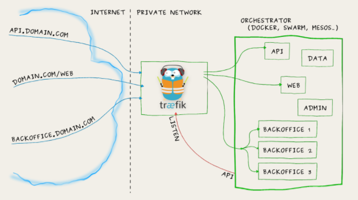

#  traefik简介
https://www.jianshu.com/p/1afe374f4333

https://blog.csdn.net/java_zyq/article/details/82496842

https://www.kubernetes.org.cn/tags/traefik
```
Træfɪk 是一个为了让部署微服务更加便捷而诞生的现代HTTP反向代理、负载均衡工具。 它支持多种后台 (Docker, Swarm, Kubernetes, Marathon, Mesos, Consul, Etcd, Zookeeper, BoltDB, Rest API, file…) 
来自动化、动态的应用它的配置文件设置。

```




# 特性

```

它非常快
无需安装其他依赖，通过Go语言编写的单一可执行文件
支持 Rest API
多种后台支持：Docker, Swarm, Kubernetes, Marathon, Mesos, Consul, Etcd, 并且还会更多
后台监控, 可以监听后台变化进而自动化应用新的配置文件设置
配置文件热更新。无需重启进程
正常结束http连接
后端断路器
轮询，rebalancer 负载均衡
Rest Metrics
支持最小化 官方 docker 镜像
后台支持SSL
前台支持SSL（包括SNI）
清爽的AngularJS前端页面
支持Websocket
支持HTTP/2
网络错误重试
支持Let’s Encrypt (自动更新HTTPS证书)
高可用集群模式

```

# 清爽的界面，Træfɪk 拥有一个基于AngularJS编写的简单网站界面


# 安装部署

下载https://github.com/containous/traefik/tree/v1.7

```
  cd /opt/traefik-1.7/examples/k8s
```

# 修改yaml 文件

ingress-traefik.namespace.yaml

```
kind: Namespace
apiVersion: v1
metadata:
  name: ingress-traefik
  labels:
    name: ingress-traefik
```

traefik-rbac.yaml

```
---
kind: ClusterRole
apiVersion: rbac.authorization.k8s.io/v1beta1
metadata:
  name: traefik-ingress-controller
rules:
  - apiGroups:
      - ""
    resources:
      - services
      - endpoints
      - secrets
    verbs:
      - get
      - list
      - watch
  - apiGroups:
      - extensions
    resources:
      - ingresses
    verbs:
      - get
      - list
      - watch
  - apiGroups:
    - extensions
    resources:
    - ingresses/status
    verbs:
    - update
---
kind: ClusterRoleBinding
apiVersion: rbac.authorization.k8s.io/v1beta1
metadata:
  name: traefik-ingress-controller
roleRef:
  apiGroup: rbac.authorization.k8s.io
  kind: ClusterRole
  name: traefik-ingress-controller
subjects:
- kind: ServiceAccount
  name: traefik-ingress-controller
  namespace: ingress-traefik
  
```

traefik-ds.yaml

这也就很好的说明了我为什么喜欢把负载均衡器部署为 Daemon Set；因为无论如何请求首先是被负载均衡器拦截的，所以在每个 node 上都部署一下，同时 hostport 方式监听 80 端口；那么就解决了其他方式部署不确定 负载均衡器在哪的问题，同时访问每个 node 的 80 都能正确解析请求；如果前端再 放个 nginx 就又实现了一层负载均衡


```

---
apiVersion: v1
kind: ServiceAccount
metadata:
  name: traefik-ingress-controller
  namespace: ingress-traefik
---
kind: DaemonSet
apiVersion: extensions/v1beta1
metadata:
  name: traefik-ingress-controller
  namespace: ingress-traefik
  labels:
    k8s-app: traefik-ingress-lb
spec:
  template:
    metadata:
      labels:
        k8s-app: traefik-ingress-lb
        name: traefik-ingress-lb
    spec:
      serviceAccountName: traefik-ingress-controller
      terminationGracePeriodSeconds: 60
      containers:
      - image: traefik:1.7
        name: traefik-ingress-lb
        ports:
        - name: http
          containerPort: 80
        - name: admin
          containerPort: 8080
        securityContext:
          capabilities:
            drop:
            - ALL
            add:
            - NET_BIND_SERVICE
        args:
        - --api
        - --kubernetes
        - --logLevel=INFO
---
kind: Service
apiVersion: v1
metadata:
  name: traefik-ingress-service
  namespace: ingress-traefik
spec:
  selector:
    k8s-app: traefik-ingress-lb
  type: NodePort
  ports:
    - protocol: TCP
      port: 80
      name: web
    - protocol: TCP
      port: 8080
      name: admin
```

cheese-deployments.yaml

```
---
kind: Deployment
apiVersion: extensions/v1beta1
metadata:
  name: stilton
  namespace: ingress-traefik
  labels:
    app: cheese
    cheese: stilton
spec:
  replicas: 2
  selector:
    matchLabels:
      app: cheese
      task: stilton
  template:
    metadata:
      labels:
        app: cheese
        task: stilton
        version: v0.0.1
    spec:
      containers:
      - name: cheese
        image: errm/cheese:stilton
        resources:
          requests:
            cpu: 100m
            memory: 50Mi
          limits:
            cpu: 100m
            memory: 50Mi
        ports:
        - containerPort: 80
---
kind: Deployment
apiVersion: extensions/v1beta1
metadata:
  name: cheddar
  namespace: ingress-traefik
  labels:
    app: cheese
    cheese: cheddar
spec:
  replicas: 2
  selector:
    matchLabels:
      app: cheese
      task: cheddar
  template:
    metadata:
      labels:
        app: cheese
        task: cheddar
        version: v0.0.1
    spec:
      containers:
      - name: cheese
        image: errm/cheese:cheddar
        resources:
          requests:
            cpu: 100m
            memory: 50Mi
          limits:
            cpu: 100m
            memory: 50Mi
        ports:
        - containerPort: 80
---
kind: Deployment
apiVersion: extensions/v1beta1
metadata:
  name: wensleydale
  namespace: ingress-traefik
  labels:
    app: cheese
    cheese: wensleydale
spec:
  replicas: 2
  selector:
    matchLabels:
      app: cheese
      task: wensleydale
  template:
    metadata:
      labels:
        app: cheese
        task: wensleydale
        version: v0.0.1
    spec:
      containers:
      - name: cheese
        image: errm/cheese:wensleydale
        resources:
          requests:
            cpu: 100m
            memory: 50Mi
          limits:
            cpu: 100m
            memory: 50Mi
        ports:
        - containerPort: 80
```
cheese-services.yaml

```
---
apiVersion: v1
kind: Service
metadata:
  name: stilton
  namespace: ingress-traefik
spec:
  ports:
  - name: http
    targetPort: 80
    port: 80
  selector:
    app: cheese
    task: stilton
---
apiVersion: v1
kind: Service
metadata:
  name: cheddar
  namespace: ingress-traefik
spec:
  ports:
  - name: http
    targetPort: 80
    port: 80
  selector:
    app: cheese
    task: cheddar
---
apiVersion: v1
kind: Service
metadata:
  name: wensleydale
  namespace: ingress-traefik
spec:
  ports:
  - name: http
    targetPort: 80
    port: 80
  selector:
    app: cheese
    task: wensleydale
```

ui.yaml

```
---
apiVersion: v1
kind: Service
metadata:
  name: traefik-web-ui
  namespace: ingress-traefik
spec:
  selector:
    k8s-app: traefik-ingress-lb
  ports:
  - name: web
    port: 80
    targetPort: 8080
---
apiVersion: extensions/v1beta1
kind: Ingress
metadata:
  name: traefik-web-ui
  namespace: ingress-traefik
spec:
  rules:
  - host: traefik-ui.minikube
    http:
      paths:
      - path: /
        backend:
          serviceName: traefik-web-ui
          servicePort: web
```

cheese-default-ingress.yaml

```
apiVersion: extensions/v1beta1
kind: Ingress
metadata:
  name: cheese-default
  namespace: ingress-traefik
spec:
  backend:
    serviceName: stilton
    servicePort: 80
```


cheeses-ingress.yaml

```
apiVersion: extensions/v1beta1
kind: Ingress
metadata:
  name: cheeses
  namespace: ingress-traefik
  annotations:
    traefik.frontend.rule.type: PathPrefixStrip
spec:
  rules:
  - host: cheeses.minikube
    http:
      paths:
      - path: /stilton
        backend:
          serviceName: stilton
          servicePort: http
      - path: /cheddar
        backend:
          serviceName: cheddar
          servicePort: http
      - path: /wensleydale
        backend:
          serviceName: wensleydale
          servicePort: http
```


# 执行yaml

```
kubectl apply -f .
```

# 查看效果
kubectl -n ingress-traefik get pod,svc,ingress -o wide
```
NAME                                   READY   STATUS    RESTARTS   AGE     IP             NODE            NOMINATED NODE   READINESS GATES
pod/cheddar-5cc7854cbd-m7mkf           1/1     Running   0          5h6m    10.254.28.11   192.168.1.170   <none>           <none>
pod/cheddar-5cc7854cbd-p9r7h           1/1     Running   0          5h6m    10.254.98.13   192.168.1.160   <none>           <none>
pod/stilton-5948f8564d-877rh           1/1     Running   0          5h6m    10.254.98.12   192.168.1.160   <none>           <none>
pod/stilton-5948f8564d-999g8           1/1     Running   0          5h6m    10.254.28.10   192.168.1.170   <none>           <none>
pod/traefik-ingress-controller-dmfqg   1/1     Running   0          4h17m   10.254.98.15   192.168.1.160   <none>           <none>
pod/traefik-ingress-controller-k6q6x   1/1     Running   0          4h17m   10.254.28.13   192.168.1.170   <none>           <none>
pod/wensleydale-d89d5d5f6-68bnr        1/1     Running   0          5h6m    10.254.98.14   192.168.1.160   <none>           <none>
pod/wensleydale-d89d5d5f6-r2wz4        1/1     Running   0          5h6m    10.254.28.12   192.168.1.170   <none>           <none>

NAME                              TYPE        CLUSTER-IP       EXTERNAL-IP   PORT(S)                       AGE     SELECTOR
service/cheddar                   ClusterIP   10.254.83.16     <none>        80/TCP                        5h6m    app=cheese,task=cheddar
service/stilton                   ClusterIP   10.254.188.156   <none>        80/TCP                        5h6m    app=cheese,task=stilton
service/traefik-ingress-service   NodePort    10.254.28.110    <none>        80:22680/TCP,8080:34915/TCP   4h17m   k8s-app=traefik-ingress-lb
service/wensleydale               ClusterIP   10.254.128.110   <none>        80/TCP                        5h6m    app=cheese,task=wensleydale

NAME                                HOSTS                 ADDRESS   PORTS   AGE
ingress.extensions/cheese-default   *                               80      5h6m
ingress.extensions/cheeses          cheeses.minikube                80      5h5m
ingress.extensions/traefik-web-ui   traefik-ui.minikube             80      5h6m

```

# 访问服务（要配置hosts，和开启防火墙端口）

http://cheeses.minikube:22680/stilton

http://cheeses.minikube:22680/stilton

http://cheeses.minikube:22680/stilton

http://traefik-ui.minikube:34915/dashboard/


# 其他特性(待验证)

```
6、部分特性说明

文章开头列举了一下 Traefik 的众多特性，有很多我还没了解到，目前了解到其中有两个很好的特性。

6.1 自动熔断

在集群中，当某一个服务大量出现请求错误，或者请求响应时间过久，或者返回500+错误状态码时，我们希望可以主动剔除该服务，也就是不在将请求转发到该服务上，而这一个过程是自动完成，不需要人工执行。Traefik 通过配置很容易就能帮我们实现，Traefik 可以通过定义策略来主动熔断服务。

NetworkErrorRatio() > 0.5：监测服务错误率达到50%时，熔断。
LatencyAtQuantileMS(50.0) > 50：监测延时大于50ms时，熔断。
ResponseCodeRatio(500, 600, 0, 600) > 0.5：监测返回状态码为[500-600]在[0-600]区间占比超过50%时，熔断。
6.2 负载均衡策略

Traefik 提供两种负载均衡策略支持。一种是 wrr（加权轮训调度算法），一种是 drr（动态加权循环调度算法）。

从上边截图右侧我们看到提示 Load Balancer: wrr，默认的策略为根据权重轮训调度，从图上可以看出，新创建的 service 权重都是一样为 1，这样的话，请求会平均分给每个服务，但是这样很多时候会出现资源分配不均衡的问题，比如由于集群中每个机器配置不一样，而且服务消耗不一样，假设 A 资源使用率已经很高，而 B 属于空闲状态，如果还是均摊到每个服务的话，会加重 A 的负荷，这时候因该有一种策略能够主动识别并分担更多流量到 B 才对。

drr 就更加智能，它是一种动态加权轮训调度方式，它会记录一段时间内转发到 A 的请求数，跟转发到 B 的请求数对比，转发数量多，说明处理速度快，响应时间快。如果 A 处理请求速度比 B 快，那么就会调整 A 的权重，接下来的一段时间，就会转发更多请求给 A，相应的 B 的转发就少一些。整个过程都在不断的调整权重，实现请求的合理分配，从而达到资源使用最大化。

```
